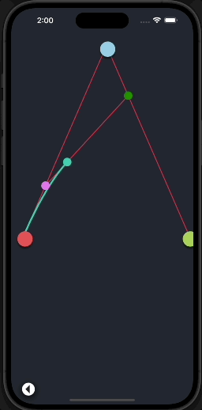
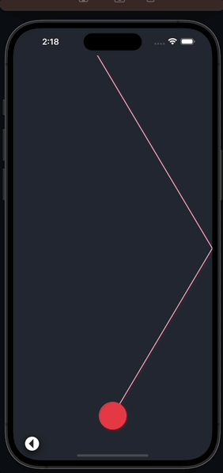
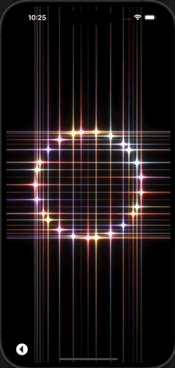
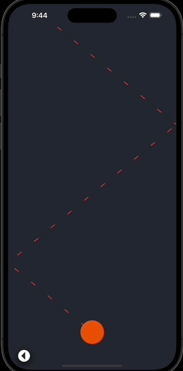

# React Native  Samples
## Pre-requisites

- npm
- yarn
- brew (MacOS)
- npx

After having installed the software listed above, visit 
[this site](https://reactnative.dev/docs/environment-setup), select 'React 
Native CLI Quickstart', then select your Development OS and your Target OS, and 
follow the instructions under 'Installing dependencies'.

## Installation

1. Clone this repo on your machine and open it at its root level on your 
Terminal (or Console).
2. Install project dependencies with `yarn install`
3. Install pods `RCT_NEW_ARCH_ENABLED=1 bundle exec pod install  --project-directory=ios/` or `pod install  --project-directory=ios/` for old ARCH
4. Run project on ios with `yarn ios`.
5. Run project on Android  with `yarn android`.

Some challenging samples built in react-native

## 🚀 Samples
| Project | |
| :--- | --- |
| <h3>1. Bézier curves</h3> Some samples demonstrating the usage of Bézier curves using Reanimated and SVG.   | </a> |
| <h3>2.Trippy Shader</h3> Playing with shaders using reanimated, skia & glsl.   | </a> |
| <h3>3. Vector Reflection</h3> Here are some examples showcasing the usage of vectors, dot product, and vector projection, implemented with Reanimated and Skia.   | </a> |
| <h3>5. Grid Shader</h3> Animating the unit circle using sine and cosine functions, incorporating vibrant colorsthethe help of Skia & Reanimated.   | </a> |
| <h3>4. Vector Reflection</h3> Here are some examples showcasing the usage of vectors, dot product, and vector projection, implemented with Reanimated and SVG.   | </a> |